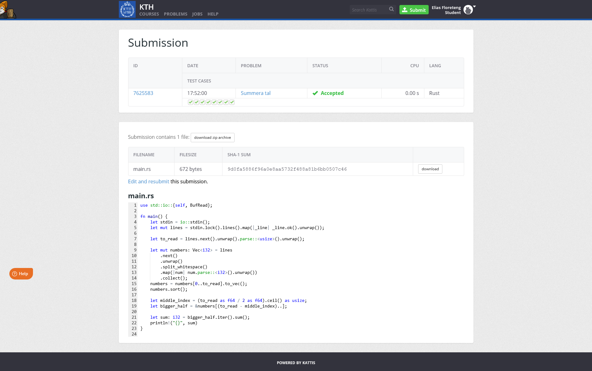
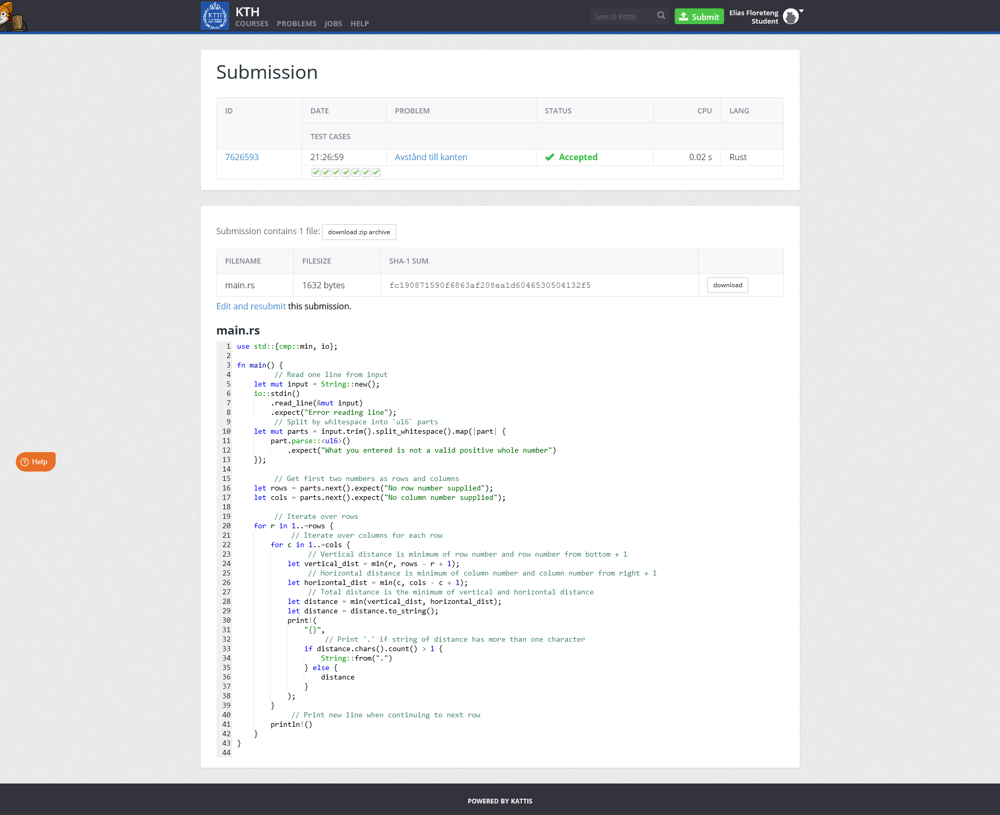
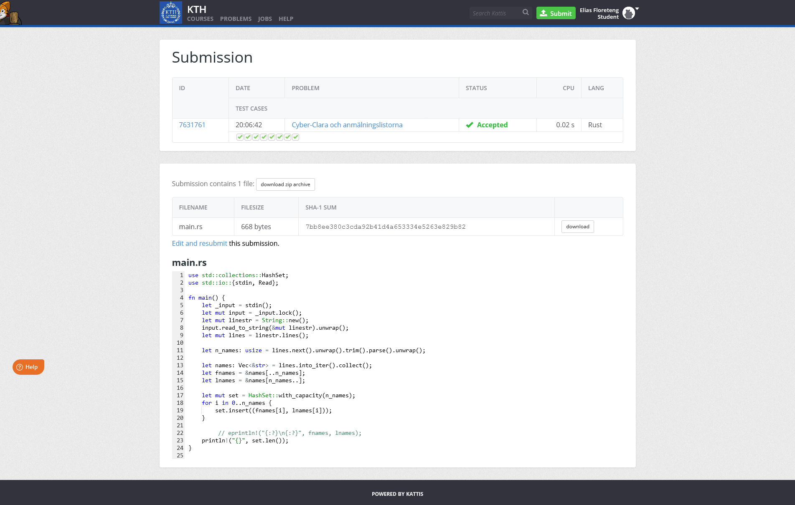
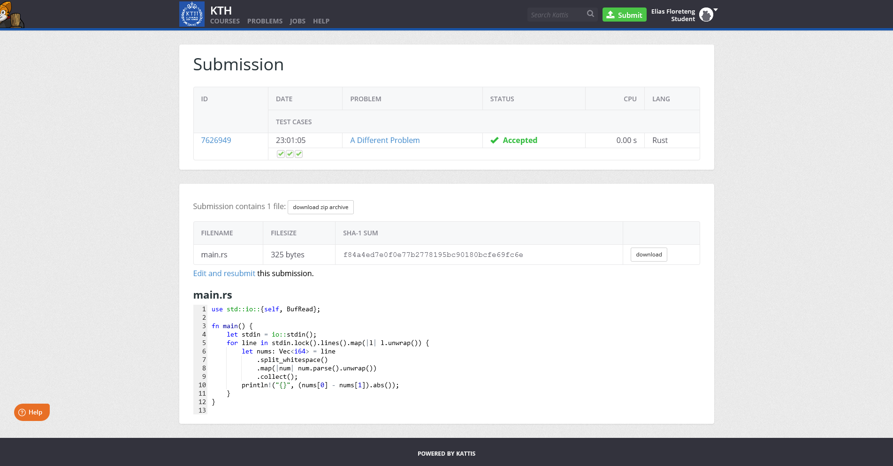

# eliasfl-task-2

## Summera tal

Crate name (subfolder): [`sum_numbers`](sum_numbers/)

Assignment: https://kth.kattis.com/problems/kth.javap.sumsort

Submission proof:

## Avstånd till kanten

Crate name (subfolder): [`dist_to_side`](dist_to_side/)

Assignment: https://kth.kattis.com/problems/kth.javap.kant

Submission proof:

## Cyber-Clara och anmälningslistorna

Crate name (subfolder): [`cyber_clara`](cyber_clara/)

Assignment: https://kth.kattis.com/problems/kth.grupdat.anmalningslistorna

Submission proof:

## A Different Problem

Crate name (subfolder): [`abs_difference`](abs_difference/)

Assignment: https://kth.kattis.com/problems/different

Submission proof:

