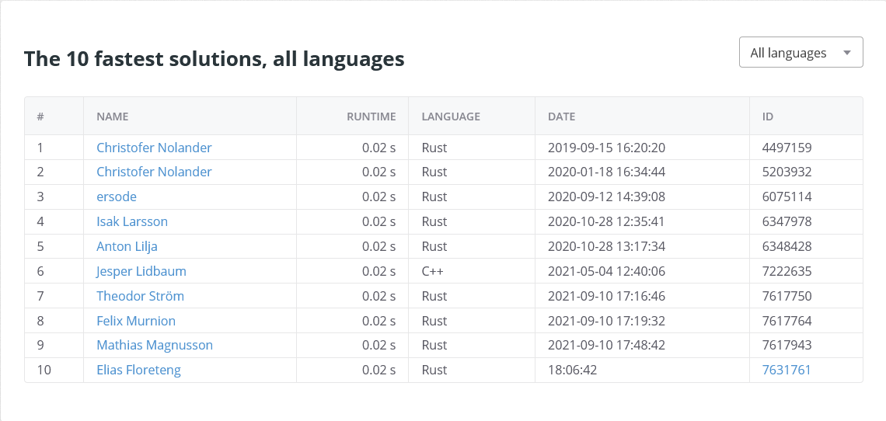

# eliasfl-task-2

## Cyber-Clara och anmälningslistorna

Source code (in crate directory): [`cyber_clara/src/main.rs`](cyber_clara/src/main.rs)

Assignment: https://kth.kattis.com/problems/kth.grupdat.anmalningslistorna

Execution time: 0.02s

Leaderboard:

Submission proof:

## Summera tal

Source code (in crate directory): [`sum_numbers/src/main.rs`](sum_numbers/src/main.rs)

Assignment: https://kth.kattis.com/problems/kth.javap.sumsort

Submission proof:

## Avstånd till kanten

Source code (in crate directory): [`dist_to_side/src/main.rs`](dist_to_side/src/main.rs)

Assignment: https://kth.kattis.com/problems/kth.javap.kant

Submission proof:

## A Different Problem

Source code (in crate directory): [`abs_difference/src/main.rs`](abs_difference/src/main.rs)

Assignment: https://kth.kattis.com/problems/different

Submission proof:

